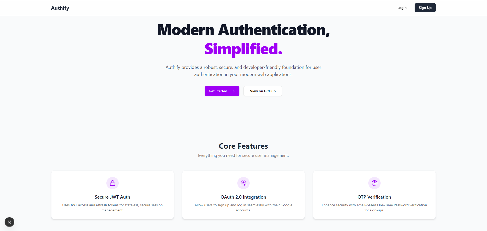
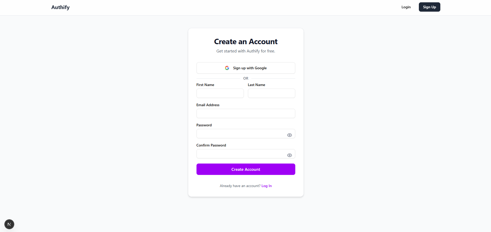
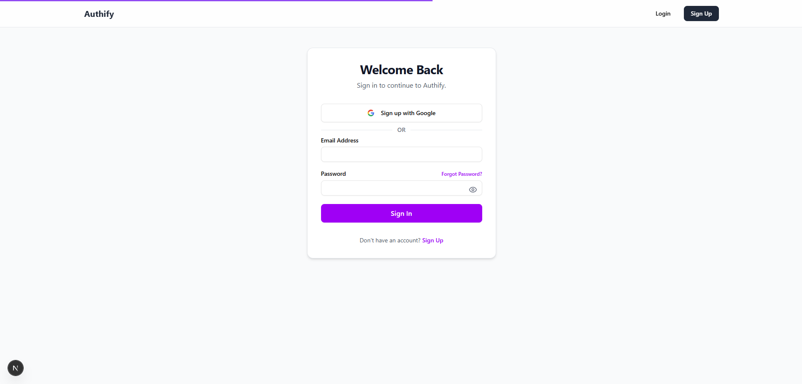

# Authify 🔐

A modern, full-stack authentication system built with the MERN stack (Next.js, Express.js, Node.js) designed to provide a secure, feature-rich, and developer-friendly foundation for any web application.


---

## ✨ Live Demo & Screenshots

Authify provides a seamless and responsive user experience from the landing page to the final authentication step.

| Home Page                               | Sign Up Page                          | Login Page                          |
| --------------------------------------- | ------------------------------------- | ----------------------------------- |
|  |  |  |

---

## 🚀 Core Features

Authify comes packed with essential features for modern user management and security.

* **Secure JWT Authentication**: Uses JWT with **Access and Refresh Tokens** stored in secure, **HTTP-Only cookies**.
* **Google OAuth 2.0**: Allows users to sign up and log in instantly with their Google accounts.
* **Email OTP Verification**: Enhances security by requiring new users to verify their email with a One-Time Password.
* **Robust Password Security**: Hashes user passwords using **bcrypt** before storing them in the database.
* **Modern Frontend**: Built with **Next.js 14** (App Router) and styled with **Tailwind CSS** and **shadcn/ui**.
* **Type-Safe Form Validation**: Utilizes **React Hook Form** and **Zod** for robust, schema-based form validation.
* **Polished User Experience**: Features a top-loading progress bar (**nprogress**), and professional notifications (**Sonner**).
* **Structured Backend**: Clean, scalable backend architecture following MVC patterns (Routes, Controllers, Models, Middlewares).

---

## 🛠️ Tech Stack

This project is built with a modern, industry-standard technology stack.

### Frontend

| Technology        | Description                              |
| ----------------- | ---------------------------------------- |
| **Next.js** | React framework for server-side rendering. |
| **React** | UI library for building components.      |
| **Tailwind CSS** | Utility-first CSS framework for styling. |
| **shadcn/ui** | Re-usable components built with Radix UI.  |
| **React Hook Form**| Performant, flexible, and extensible forms. |
| **Zod** | TypeScript-first schema validation.      |
| **Axios** | Promise-based HTTP client for API calls. |
| **Sonner** | A beautiful toast notification library.  |
| **nprogress** | Slim progress bar for page navigation.   |
| **Lucide React** | Beautiful and consistent icons.          |

### Backend

| Technology     | Description                                |
| -------------- | ------------------------------------------ |
| **Node.js** | JavaScript runtime environment.            |
| **Express.js** | Minimalist web framework for Node.js.      |
| **MongoDB** | NoSQL database for storing user data.      |
| **Mongoose** | ODM library for MongoDB and Node.js.       |
| **JWT** | JSON Web Tokens for authentication.        |
| **Bcrypt** | Library for hashing passwords.             |
| **Nodemailer** | Module for sending emails (used for OTP).  |
| **Cors** | Middleware for enabling Cross-Origin Sharing.|

---

## 🏁 Getting Started

To get a local copy up and running, follow these simple steps.

### Prerequisites

* Node.js (v18 or higher)
* npm or yarn
* MongoDB instance (local or Atlas)

### Installation

1.  **Clone the repository:**
    ```sh
    git clone [https://github.com/your-username/Authify.git](https://github.com/your-username/Authify.git)
    cd Authify
    ```

2.  **Install Backend Dependencies:**
    ```sh
    cd server
    npm install
    ```

3.  **Install Frontend Dependencies:**
    ```sh
    cd ../client
    npm install
    ```

4.  **Set Up Environment Variables:**
    Create a `.env` file in the `server` directory and add the necessary variables. Use the `.env.sample` as a guide.

    ```env
    # .env file in /server directory
    PORT=8000
    MONGODB_URI=your_mongodb_connection_string

    CORS_ORIGIN=http://localhost:3000

    ACCESS_TOKEN_SECRET=your_super_secret_access_token
    ACCESS_TOKEN_EXPIRY=1d

    REFRESH_TOKEN_SECRET=your_super_secret_refresh_token
    REFRESH_TOKEN_EXPIRY=10d

    # For OTP Email Verification (e.g., using Gmail)
    EMAIL_USER=youremail@gmail.com
    EMAIL_PASS=your_gmail_app_password
    ```

5.  **Run the Application:**
    * To run the backend server:
        ```sh
        cd server
        npm run dev
        ```
    * To run the frontend client (in a new terminal):
        ```sh
        cd client
        npm run dev
        ```

    Open [http://localhost:3000](http://localhost:3000) in your browser to see the result.

---


## 👨‍💻 Author

**Ammad Hamid**

* GitHub: [@ammadhamid](https://github.com/ammadhamid)
* Feel free to connect with me!